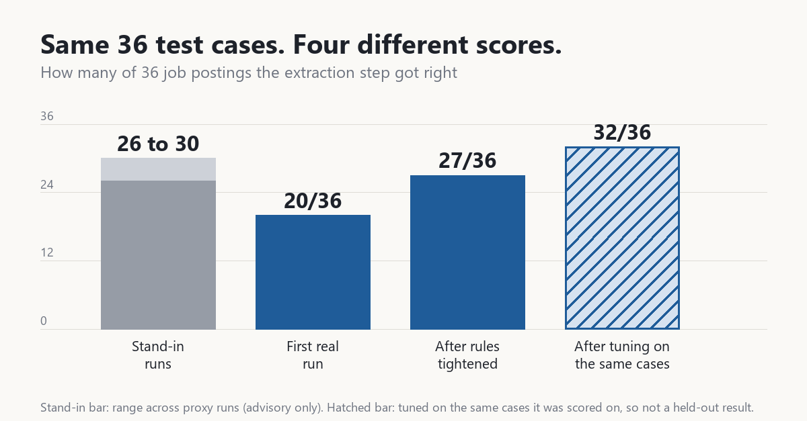
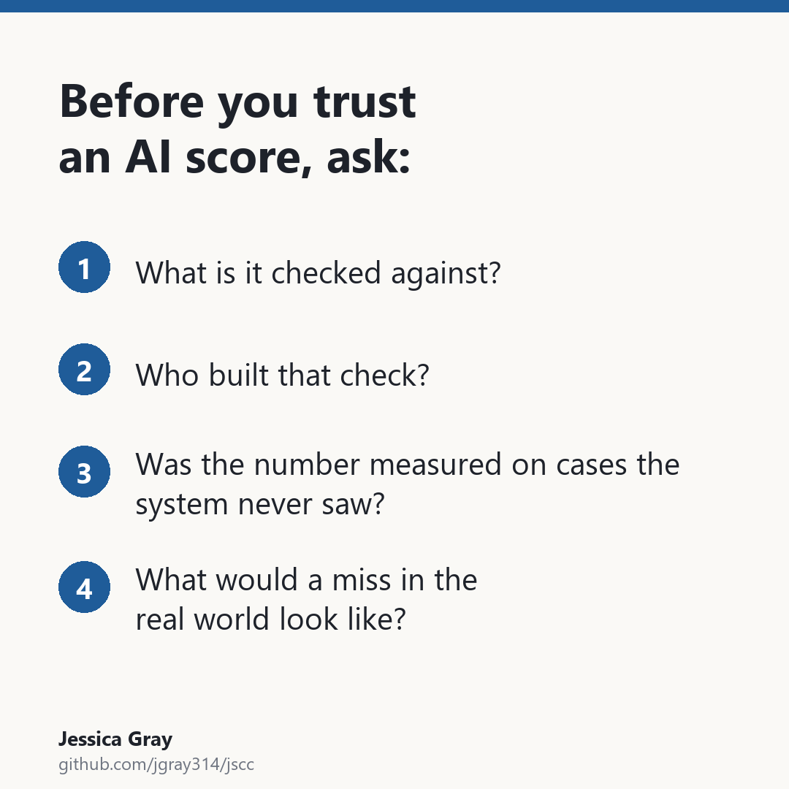

# Same Test Cases, Different Scores

## Checking the Right Thing

My job-scoring tool gave a job a 7.3 out of 10. It had credited the role with three teams, but the description was of the whole organization, not the role, which owned only two of the three. I caught it in the written detailed output when I was surprised by how high the score was. But it was easy to miss, especially since it was wrong in the direction I wanted to believe. A score is only as trustworthy as the thing it's checked against, and that check can't come from the system that built it. I learned that first fighting fraud with data. This is a story about being reminded of it, and what it means for building and using AI-based tools.

## What to Check Isn’t Always Obvious

I saw the same root cause hit three times before I truly understood and could fix the problem. First, the example I just shared. Second, when my tool hit a posting it couldn’t load, it pulled a different posting with a similar title. Unfortunately that posting was for a team that reports into the role I wanted to score. Third, a posting listed the team’s ambitions for the future and the tool treated it as the current state of the team.

The underlying bug: the tool read a true statement correctly, but credited it to the role under review instead of to the wider organization or a future goal. I initially addressed the narrower failures, but the third time it appeared I paused and was able to see what these issues had in common. The answer was a question the tool had never considered. Whose description am I reading and how does it relate to the job I am supposed to score?

Once that insight was integrated into the tool, it ran clean through more than 20 roles where I reviewed the detailed notes that drove scoring. It had taken two rewrites in about a week to get there. The lesson was not about weights. Better scoring came from checking where a claim came from, not from tuning how much it counted.

## The Same Problem, Bigger

When I adapted the tool I built for myself into an independent project to get up to speed building with AI, I saw the importance of taking this approach again, magnified. AI had made producing code and code tests cheap. Model verification became the bottleneck. I could update instructions in a minute or two. Proving it worked took most of an hour per round to do by hand.

The first task was pulling structured fields from a job posting: title, salary, required skills. I made 36 sample postings, with expected answers for each. The code would send the same instructions, but I tested them by hand in chat, so they had to work there on their own.

I kicked off iteration with a stand-in: AI agents told to answer as the model would. It could parallelize and run all cases in a few minutes. Across runs it scored between 26 and 30 of 36. Then I ran against chat getting only 20 of 36. The misses were small: including title as a required skills - banned in my instructions, returning “competitive compensation” instead of a salary band. I used the stand-in to debug, and after some iteration it got 30 right, but those instructions only scored 27 in chat.

I needed to debug using chat. It was ignoring rules that the stand-in followed. I was able to work through case by case and address 8 of the 9 misses.

Testing just the API was useful, but insufficient on its own.

The stand-in was useful for getting quickly to a potentially viable starting point, iterating over samples multiple times in minutes. But I needed to use chat to validate and debug issues in that context.

## Limits of a Single Run

After one more round of tuning, chat reached 32 of 36. I was still not done. Each fix came from a case I had already seen fail. There was a real risk of overfit, where the model performance is overindexed to the examples provided. Data scientists keep 20 to 30 percent of their data out of training as a holdout, for this reason. My extraction test does not have one yet, so 32 of 36 is not a held-out rate. I applied it in a later part of my project, routing, keeping 10 cases aside, written by an agent that never saw the instructions. All 10 passed. With only 10 cases, that shows no failure. It is not a rate.

*Same 36 test cases, four different scores. The last bar was tuned on the cases it was scored on, so it is not a held-out result.*

## Simple Checks

Three habits came out of fighting fraud:

1. Use cheap checks to move fast, and independent ones to validate.
2. Name failures by source, not symptom.
3. Publish defensible, not optimistic numbers.

The same holds when you buy AI, hire for it, or manage a team that builds it.

If you are interested in the independent project I mentioned, the code is public at [github.com/jgray314/jscc](https://github.com/jgray314/jscc).

What was the last AI score you trusted, and what was it checked against?
